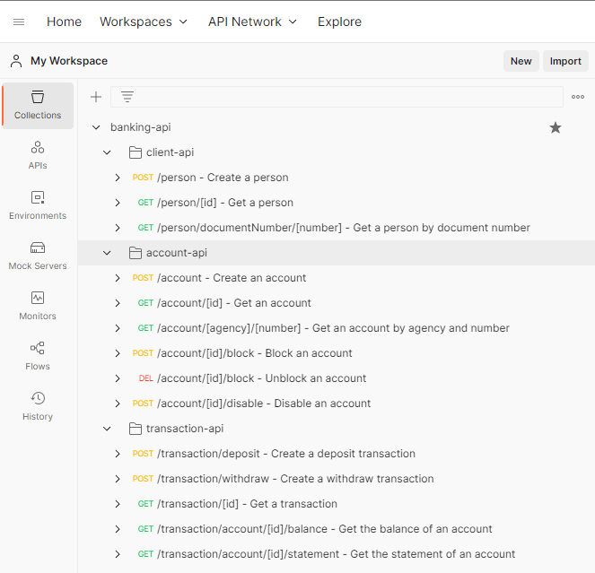

### Importando

- Importando os endpoints e enviroments no Postman:
    - Certificar que possui versões mais atualizadas do postman;
    - Abrir o postman, estando logado e/ou com ambiente pronto para uso;
    - Ir até a opção `Import > Folder` e importar essa pasta do projeto.
    
    
    - Resultado esperado:
    
    

### Uso

Os endpoints do tipo create (por ex, `create a person`, `create an account` ...) elas possuem um script onde será guardado o `id` que será utilizado pelos demais endpoints.

Por exemplo, o endpoint `create a person` irá criar uma pessoa e o cpf e id ficará salvo para ser usado por outros endpoints, como `get a person`, `get a person by document number (cpf)`, `delete a person` ou até mesmo a criação de uma conta bancária através do endpoint `create an account`.

### WIP - Working in progress