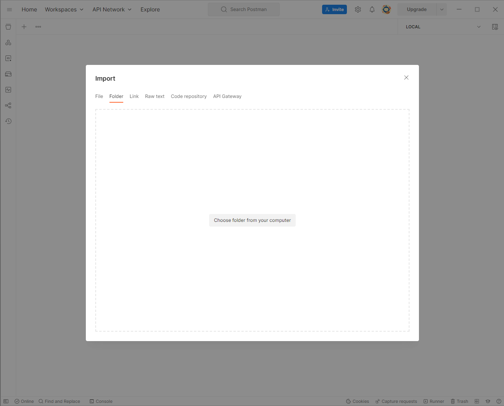
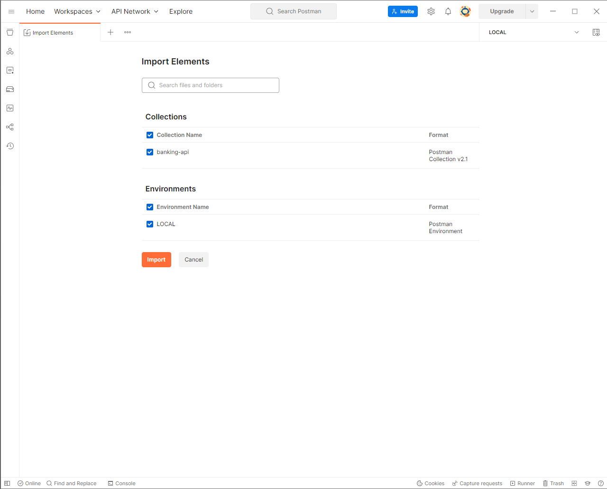
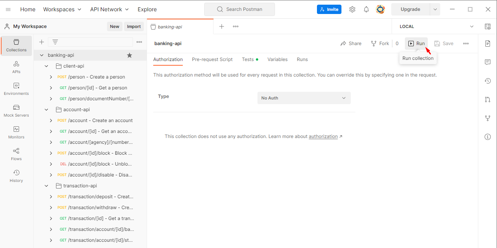
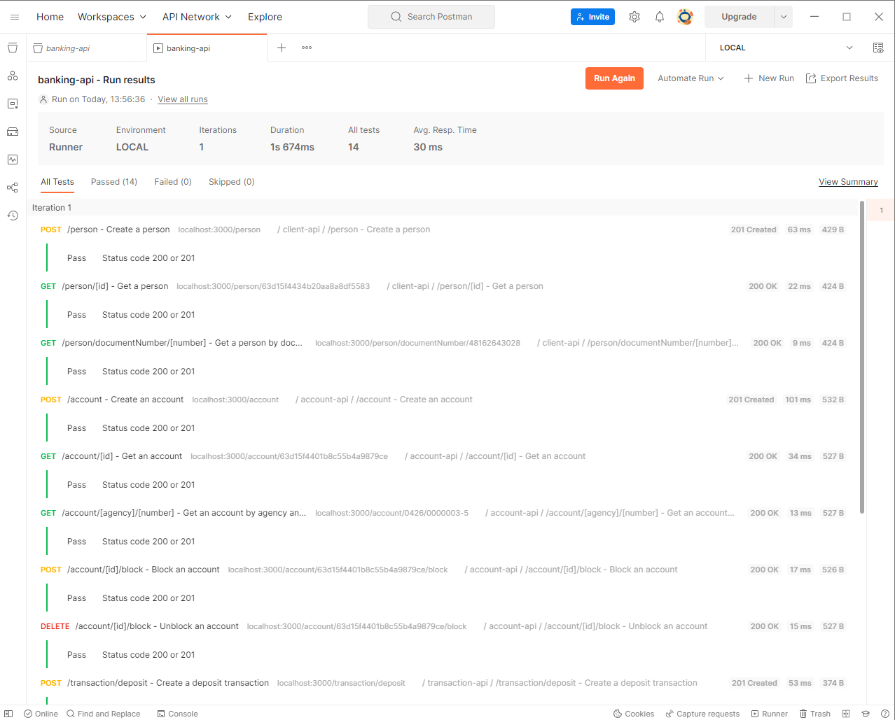

### Importando

<ul>
    <li>Certificar que possui versões mais atualizadas do postman;</li>
    <li>Abrir o postman, estando logado e/ou com ambiente pronto para uso;</li>
    <li>
        Ir até a opção `Import > Folder` e importar essa pasta do projeto: 
            
        
    </li>
    <li>
        Resultado esperado: 
        
        
    </li>
</ul>

### Uso

Os endpoints do tipo create (por ex, `create a person`, `create an account` ...) elas possuem um script onde será guardado o `id` que será utilizado pelos demais endpoints.

Por exemplo, o endpoint `create a person` irá criar uma pessoa e o cpf e id ficará salvo para ser usado por outros endpoints, como `get a person`, `get a person by document number (cpf)` ou até mesmo a criação de uma conta bancária através do endpoint `create an account`.

### Testes

O Postman possui realização de testes de integração, que no momento, está configurado apenas para verificar se houve status 200 ou 201.

Para realizar os testes, contanto que já tenha [importado](#importando) a collection, basta seguir esse passo a passo.

<ul>
    <li>
        Clicar na pasta principal da collection e em seguida clicar em <code>Run</code>: 
        
    </li>
    <li>
        Ajustar as preferências (o padrão já atende) e em seguida <code>Run desafio-dev-api-rest</code>: 
        
    </li>
    <li>
        Resultado esperado: 
        
    </li>
</ul>

### Documentação

A documentação da API é gerada via Postman que está disponível [aqui](https://documenter.getpostman.com/view/7620522/2s8ZDa1LoC).