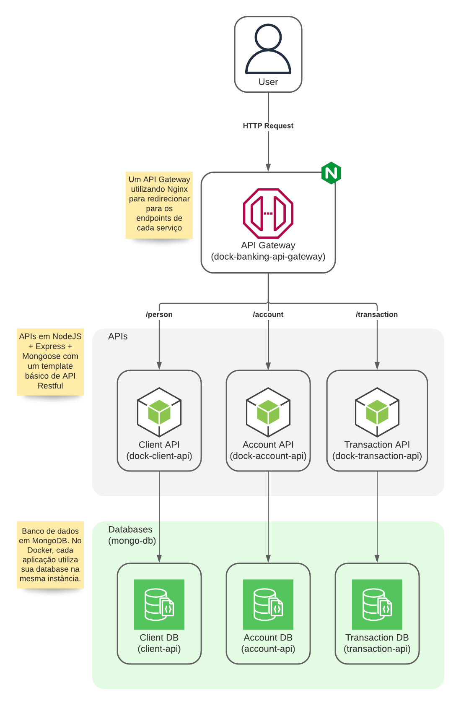

# desafio-dev-api-rest

Desafio técnico para empresa Dock com a finalidade de desenvolvimento de uma aplicação bancária.


## Arquitetura

A arquitetura escolhida pra esse projeto foi de microsserviço, onde é separado os microsserviços essenciais da aplicação
com um api gateway para unificar os endpoints.



## Stack utilizada

**dock-banking-api-gateway:** Nginx

**dock-client-api:** NodeJS, Express, Mongoose

**dock-account-api:** Node, Express, Mongoose

**dock-transaction-api:** Node, Express, Mongoose

**database:** MongoDB


## Documentação da API

A documentação da API é gerada via Postman.

```http
POST /person - Cadastrar uma pessoa.
POST /account - Cadastrar uma conta digital dock.
POST /transaction/deposit - Fazer um depósito.
POST /transaction/withdraw - Fazer um saque.
GET  /transaction/account/[id]/statement - Consultar extrato bancário.
...
```

Documentação completa está disponível [aqui](https://documenter.getpostman.com/view/7620522/2s8ZDa1LoC).

## Rodando localmente

Para cada aplicação, um serviço diferente numa porta diferente.
```
dock-banking-api-gateway - localhost:3000 //TODO: disponibilizar configuração para Nginx
dock-client-api          - localhost:3001
dock-account-api         - localhost:3002
dock-transaction-api     - localhost:3003
```

### Local

Para cada aplicação, exceto `dock-banking-api-gateway`, rodar os comandos abaixo:

```shell
$ cd dock-client-api/ #dock-account-api ou dock-transaction-api
$ npm install
$ npm start
```

### Docker

Na pasta principal possui um `docker-compose.yml` onde é necessário apenas rodar `docker-compose up` para iniciar as aplicações.

Recomende-se o uso do [postman](#postman) abaixo sobre testes dos endpoints.


## Testes

### Postman

Para testes da aplicação, é possível com auxílio do [postman](/postman/), onde será possível testar todos os endpoints. 
Dentro da pasta, possui uma collection e como importar e usa-las.

---

### Enunciado do desafio

---

# Cenário

A Dock está crescendo e expandindo seus negócios, gerando novas oportunidades de revolucionar o mercado financeiro e criar produtos diferenciados.
Nossa próxima missão é construir uma nova conta digital Dock para nossos clientes utilizarem através de endpoints, onde receberemos requisições em um novo backend que deverá gerenciar as contas e seus portadores (os donos das contas digitais).

# Requisitos

- Deve ser possível criar e remover **portadores**
    - Um **portador** deve conter apenas seu *nome completo* e *CPF*
    - O *CPF* deve ser válido e único no cadastro de **portadores**
- As **contas digital Dock** devem conter as seguintes funcionalidades:
    - A conta deve ser criada utilizando o *CPF* do **portador**
    - Uma conta deve ter seu *saldo*, *número* e *agência* disponíveis para consulta
    - Necessário ter funcionalidade para fazer a *consulta de extrato* da conta *por período*
    - Um **portador** pode fechar a **conta digital Dock** a qualquer instante
    - Executar as operações de *saque* e *depósito*
        - *Depósito* é liberado para todas as *contas ativas* e *desbloqueadas*
        - *Saque* é permitido para todas as *contas ativas* e *desbloqueadas* desde que haja *saldo disponível* e não ultrapasse o limite diário de *2 mil reais*

## Regulação obrigatória

- Precisamos *bloquear* e *desbloquear* a **conta digital Dock** a qualquer momento
- A **conta digital Dock** nunca poderá ter o *saldo negativo*


#  Orientações

Utilize qualquer uma das linguagens de programação:
- Java
- Javascript
- Typescript
- Python
- Kotlin
- Golang

Desenvolva o case seguindo as melhores práticas que julgar necessário, aplique todos os conceitos, se atente a qualidade, utilize toda e qualquer forma de governança de código válido. Vamos considerar toda e qualquer implementação, trecho de código, documentação e/ou intenção compartilhada conosco. Esperamos também que o desafio seja feito dentro do tempo disponibilizado e que esteja condizente com a posição pretendida.

É necessário ter o desafio 100% funcional contendo informações e detalhes sobre: como iniciar a aplicação, interagir com as funcionalidades disponíveis e qualquer outro ponto adicional.

## Diferenciais

- Práticas, padrões e conceitos de microservices será considerado um diferencial para nós por existir uma variedade de produtos e serviços dentro da Dock.
- Temos 100% das nossas aplicações e infraestrutura na nuvem, consideramos um diferencial, caso o desafio seja projeto para ser executado na nuvem.
- Nossos times são autônomos e têm liberdade para definir arquiteturas e soluções. Por este motivo será considerado diferencial toda: arquitetura, design, paradigma e documentação detalhando a sua abordagem.

### Instruções
      1. Faça o fork do desafio;
      2. Crie um repositório privado no seu github para o projeto e adicione como colaborador, os usuários informados no email pelo time de recrutameto ;
      3. Após concluir seu trabalho faça um push; 
      4. Envie um e-mail à pessoa que está mantendo o contato com você durante o processo notificando a finalização do desafio para validação.
